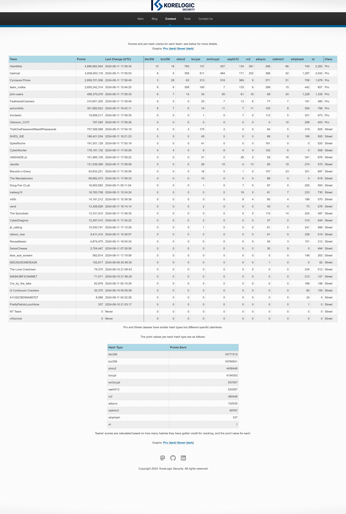

# [CMIYC 2024](https://contest-2024.korelogic.com/)

> What: The premier annual password cracking contest sponsored by KoreLogic.
>
> Where: DEF CON 32 - Las Vegas, NV, USA, and over the Internet.
>
> When: 48 hours, from 11 AM Las Vegas time (US/Pacific) Friday, August 9th, 2024 to 11 AM LV time Sunday, August 11th.
>
> Who: Anyone can play. Teams of people will do best.
>
> Why: To help push the envelope of password cracking techniques / methodologies and to challenge password crackers' skills.
>
>
> Copyright 2024. KoreLogic Security. All rights reserved
>
>
> _All Crack Me IF You Can contents originally under copyright for KoreLogic
> Security. All contest hashes and contents created and owned by Korelogic,
> and ownership belongs to them.

See prior years' contents at [korelogic's contents archive](https://contest.korelogic.com/).

Huge shoutout to Korelogic for keeping up all the way back to **2010**!!!! (One of my
goals for "offseason" this year is to go back and grab all the prior years
values and spend some time on each and noting what my experience/take
aways are for each - stay tuned to this org for future updates on that
endeavor.


## [Contest Hashes](https://contest-2024.korelogic.com/downloads.html)

Download directly from korelogic's site.

Alternatively, they are also mirrored in this repo in [contest_hashes](./contest_hashes).


## [Results](https://contest-2024.korelogic.com/stats.html)

I[^1] took 1st in the street division this year finally! This was a goal of
mine since the first time I competed (_which was, checks clock, **5 years ago**_
ha ha). This year's contest was a brutal slog. I learned some new things,
had another chance to learn how bad my work management capabilities are,
and most importantly, had fun as always.

[^1]: ThatOnePasswordWas40Passwords is a team of just myself. Though this
      year, I had someone decrypt the PCAP file and extract all the passwords
      from it and send those to me. So I wasn't _entirely_ solo. But
      my position and scoring would not have changed much if that hadn't
      been involved, since it really only gave me a handful of
      re-used passwords in the form of other hashes ... and, on top of
      that, I already knew how to get the handshake/decrypt etc. the PCAP
      but for whatever reason I couldn't get my WSL wireshark working
      this past weekend /shrug.

Score board glory:



### Progression tangent

I want to take a minute to talk not necessarily about this year's contest,
but as my experience with CMIYC as a whole over the last five years. If
you don't care and just want to skip ahead, go to [takeaways](#takeaways).

Before I got into participating in CMIYC I regularly participated in assorted
CTFs as part of the [burner_herz0g](https://ctftime.org/team/63292/) team
I helped lead. On top of that, I regularly played on miscellaneous training
sites like HackTheBox, TryHackMe, cryptopals, etc. My engagement in
cybersecurity focused things has (for now, at least? hit me up with any
opportunies?:)) been only for personal reasons. I'm a developer
professionally; the cybersecurity activities simply started as a way
to stay up to date on important topics that impact my day-day practices.
Overtime, it grew into a passion, as I got more and more exposed to
various fields within cybersecurity. Particularly, the the puzzle-like
nature of cracking really intrigued me, and I quickly got addicted to
the bliss that is seeing a running hashcat session spit out a crack.

My first year competing in CMIYC was [2020](https://contest-2020.korelogic.com/stats.html),
where I was still registering under our CTF team's burner_herz0g name.
After the contest, I had scored a whopping _**0 points**_. Despite this,
I still had a fun time, and was determined to score at least a single
point the next year.

[2021](https://contest-2021.korelogic.com/stats.html) rolls around and
that year I managed to score 94,178 points over 27,557 total hashes.
Most definitely better than 2020, good enough for 19/30. My goal of
continually improving had been met, and I was even more  This story
continued through 2022, 2023, finally culminating in 2024's performance.

2024 I achieved my ultimate goal ending a 5 year journey. Below is a
graph showing my placement over the years:

[placement-and-score-over-time](./imgs/placement_and_score_over_time.png)

> Includes scoring, though that isn't really useful.

All in all, its been a great journey. I've learned quite a bit about
the process, tools, and ideas around cracking, and like to think I'd
have a good chance at any real life situation now.

As for the upcoming year(s) - I'm not sure whats next. Maybe time to
"go pro" (just need the bus carrying team hashcat, cynosure prime,
hashmob, and john-users to get lost on the way to Defcon that year...).
Maybe stay in street and make the new goal staying top as long as
possible. Maybe its time to "make some friends" and focus less on
solo-ing the challenge and trying to form a team to help each other
learn and grow. Either way - I already have some plans for practice in
the meantime. Keep an eye out on my [Github Organization](https://github.com/ThatOnePasswordWas40Passwords)
and/or [Github account, bigpick](https://github.com/bigpick) for any
future updates on those.

If anything I've mentioned soudns interesting to you, or you're
interested in _me_, drop me an issue - I promise I'm friendly:)

---

## Takeaways

> Takeaways, notes, errata, etc.

### tl;dr

1. Being able to pivot is as critical as always.
2. GPU (or CPU) power didn't seem to matter much.
3. Meticuluous use of hashcat's `--potfile-path` made per-hash-type crack
   tracking _way_ easier this year.
4. Hints played a huge part.
    * Wish they had a planned/advertised-ahead-of-time drop schedule.
5. Need to actually follow through on off-season plans before next year.

### Contest

To decrypt pgp hint bundles:

```bash
echo ')>YN}r{Q0H%;p5mQkKj)fDt>K}=M%N}*=>LHx)fB' | gpg --batch --yes --passphrase-fd 0 <bundle>.pgp
tar xf <bundle>
cd bundle
```

#### [cmiyc-2024_street_files_1](./cmiyc-2024_street_files_1/)

##### arj

I spent maybe an hour our two messing around with these. Running
`arj e -gPASS FILE.arj` seemed to attempt to extract a file, but even
when ran with what I had thought was the correct password seemed to just
hang forever. Initially I tried brute forcing them using just a bunch
of attempts over a python multiprocessing pool, but the `arj` binary
is so gd slow that even at that it was going to be pointless.

At some point I realized `strings` revealed that the contents of the
archives seemed to just be a single note about another user in the
dump, e.g

```text
aaurelius2.arj
aaurelius2.arj
note_lucastitus
5*'~
```

To be sure, I plotted each one, and it was a complete loop, each one
appearing once:

```bash
while :; do new_fname="$(strings $fname | grep note_  | cut -d_ -f2).arj"; echo $new_fname; export fname=$new_fname; done
```

Spit out the linking, top one linking to the one below it:

```text
aaurelius2.arj
lucastitus.arj
tlynch-a.arj
...
sasukefara.arj
aaurelius2.arj
```

I never managed to crack one, but more importantly didn't get too hung
up on them, moving on after about an hour or so.

##### bundle.zip

Didn't make any progress on this one other than failing to notice that
there were nested zip pass' in it. Attempting to crack the top level
zip pass obviously did not go well.

Knowing what I know now, I should have done something like so:

```bash
binwalk bundle.zip | grep 'Zip archive data' | awk '{print $NF}' > nested_zip_names.txt

for name in $(cat nested_zip_names.txt); do echo "${name}:$(zip2hashcat bundle.zip -o $name)"; done  > nested_zip_names.hashes
```

Then look for username re-use and validate/submit for the "real" hash.

##### gocrypt

Spent about 5 minutes on this before noping out. Didn't spend any time
on this.

##### radmin.reg.bz2

Inspecting the file revealed it was a win registry dump file. Contained
A bunch of users information in blocks, with a blank line between each.

Decided to split each one into their own dedicated file (using w.e tool
you like best). Then, once they were all split, use hashcat's tool the
convert the users' file into hashes hashcat knows about:

```bash
for f in $(find radmin_users -name key_info -print); do radmin3_to_hashcat.pl $f; done > cmiyc-2024_radmin.29200.hash
```

> The resulting file is at [cmiyc-2024_radmin.29200.hash](./cmiyc-2024_street_files_1/cmiyc-2024_radmin.29200.hash)

Then, just go about cracking.


#### [cmiyc-2024_street_files_2](./cmiyc-2024_street_files_2)

##### alg_issue.txt

This was a hint about the RC2 hash, I think. Though, I did not do any
work around those.

##### leak_astroturf.txt

I took this as a hint that some of the wordlists were generated using
some sort of AI. I spent an hour or so trying to get chatgpt to give
me a nice big list of actors alongside their character role after noticing
a couple hits in the cheap hashes of such name pattern. It was alright.
Getting it to spit out unique data was a pita, and all-in-all, for
the amount of effort to the possible vector, didn't seem quite worth it
to sink more time in. Oh, and I was doing this all manually through the
chatgpt UI.

##### leak_drone.txt

This was I think just a hint file that the passwords in the `street.pcap`
file were going to be useful/reusable.

##### street.pcap

Used `cap2hccapx` to get the network creds, stored in file
[street.pcap.hc22000](./cmiyc-2024_street_files_2/street.pcap.hc22000).

Using `hashcat`, password for `kore-logic-cmiyc` ssid is `Michael!!`:

```text
2178392916e3b3fafe70e3a80a87a75c:b4750eca49a1:00c0cab05e1b:kore-logic-cmiyc:Michael!!
```

Using that, can get the 802.11 traffic in wireshark, then export all the
conversations contents. They are a mixed set of communications, but
all basically leak a user and password. These passwords were then re-used
in other dump hashes (bcrypt, etc).


#### [cmiyc-2024_street_files_3](./cmiyc-2024_street_files_3)

##### maybe_sell_shoes

This was an obvious hint about the striphashes.

##### winoneforthe.zip

```bash
zip2hashcat winoneforthe.zip > winoneforthe.zip.hash
hashcat ...
```

Gives the pass `zipper`.

```bash
unzip -P zipper winoneforthe.zip
```

Gives a directory of 964 zip files and two texts:

```bash
ls winoneforthe/*.zip | wc -l
964

ls winoneforthe/* | grep -v zip
leak_antitrust.txt
leak_superpacs.txt
```

To get all the zips' hashes:

```bash
for f in $(find winoneforthe -name "*.zip"); do fname=$(echo $f | cut -d/ -f2 | cut -d. -f1); echo "${fname}:$(zip2hashcat $f)"; done > all_zips.hash
```

I spun my wheels for a bit trying to crack these zip passwords with
wordlists/rules/combinations of things I'd seen in the cheaper hashes
up to this point. The problem with this was that I had not discovered
a single book cipher like password in the cheaper hashes.

It wasn't until late Sunday that on the last hint bundle file I had
realized what the password format for these zip files were: which was
the book cipher. That is, something of the form of 1-3 digits, 3-4 times
separated by a `:`, with a space inbetween them. e.g

```text
43:18:3 6:43:19
```

Becasuse even after that point, I _still_ hadn't figured out that this
format was re-used in the cheap hashes and not just the zip passwords
themselves, I spent a good couple of hours Sunday trying to iterate
masks on all the zips' hashes themselves. I would have saved a lot of
time (and gotten some extra points) if I would have realized that I
should have been doing the cracking against the cheapies, and then just
"freely" reusing them on the zips, instead of cracking them on the
zips themselves. Oh well.

Once you had a particular user's zip password, the contents of their zip
were a single text note file with two lines. The first being a source,
the second being a set of cipher strings that explained where in the
source to get the set of words that made up their password.

I ended up making the cipher masks by hand (would love to hear if there
is a better alternative to this specific usecase, or if anyone knows
of existing rulesets that cover it/would be able to easily extended to
cover them mostly). Because of this, I imagine I missed _quite_ a few,
and is the largest reason why I ended up only getting ~220 some of the
**964**.

Once the zip was cracked, you were left with a bunch of `<username>.txt`
files. The way I went about operating on these was to just `cat` them
all, sort, and uniq them to get an idea of if there were any major
re-uses to be able to get more bang-buck. A good amount of them seemd
to come from only a handful of `transcript_*******` looking sources.

After maybe 30 minutes of looking, I realized these were the format of
Youtube links:

```
transcript_FZ5z_KKeFqE
```

Was actually a link to a Youtube video of URL

```
https://www.youtube.com/watch?v=FZ5z_KKeFqE
```

On the video, if you enable transcripts, it pops up a set of timestamp:paragraph
lines. Looking at the `.txt` files, I noticed that not any of the digits
were over `6` in the first two spots, which made me realize they were
actually probably seconds (btw: more potential time save, since was
using `?` and not `-1 123456`). Initially I used multiple yt transcript
downloaders but they seemed to have more precision than the videos
themselves. I resorted to just manually copy and pasting the videos
transcripts into local files named the same.

I made a script to take a transcript file, and a cipher input, and
spit out the appropriate words: [cipher_to_words.py](./cmiyc-2024_street_files_3/cipher_to_words.py).

After doing a few manually, I threw together an end-end process that
looked like so:

```bash
#!/usr/bin/env bash

for transcript_url in $(cat winoneforthe/*.txt | sort | uniq -c  | grep transcript | awk '{print $NF}'); do
    echo "===== $transcript_url"

    for fpath in $(for f in $(grep -r ${transcript_url} winoneforthe); do echo $f; done | cut -d: -f 1); do cat $fpath | grep -- '-a'; done > users_${transcript_url}

    for f in $(cat users_${transcript_url} | cut -d: -f1); do grep $f /path/to/cmiyc-2024_street_passwd_1; done > users_${transcript_url}.hashes

    while IFS= read -r line; do
      ./cipher_to_words.py ${transcript_url}  "$line" >> ${transcript_url}.words
    done <<< $(cat users_${transcript_url} | cut -d: -f2- |awk '{$1=$1;print}')

    hashcat -a 0 -m 3200 -O -w4 users_${transcript_url}.hashes --username ${transcript_url}.words
done
```

> This assumes you've already manually fetched the video transcripts
> and stored them in a local file named `transcript_xxxxx`, and have
> already unzipped the user zips, and have all the `.txt` files in that
> dir.

This was **by far** the biggest source of my points. I wish I would have
been up later Saturday or earlier Sunday so that I could have had more
time with this, because the only thing holding me back from getting
much more was that I just didn't get a good enough flow down for
cracking the cipher passwords themselves on the zips:\

#### cmiyc-2024_street_files_4

This one had a zip file in it with a massive yaml file of users along
with their given/surname and occupation. I tried extracting and
running as a wordlist with varying rules against varying hashes but
I didn't seem to have any sucess with anything I tried here. Interested
to see what it actually was.

#### cmiyc-2024_street_files_5

I essentially did not look at this bunch of hits at all. When I finally
got started on Sunday, I started with `_6` - and that lead to the massive
rush of bcrypts, which I decided was worth more than anything else I
could possibly do, so I didn't bother distracting myself with it.


#### cmiyc-2024_street_files_6

As described in [cmiyc-2024_street_files_3](#cmiyc-2024_street_files_3)
this was the hint bundle that blew things wide open.

I am not sure how I didn't realize that the passwd file was telling me
that the book cipher was for that cheap hash, but /shrug. I hit it on
the zip first and never looked back.


#### Misc thoughts

* I like that the competition could have been won with basically no
requirement on GPU power.

* Sources discovered during competiton:
    * Real breach data (probably adjacently, since was just rockyou)
    * Celebrity/character namings
    * \<I think maybe one or two others but am forgetting, may update later\>

* Lets get some media references post-2000 next year? Some of us
  aren't dinosaurs;)

* Had made wordlists/passphrase lists of the Defcon themed materials
  prior to the competition and _entirely_ forgot to try using them
  during the comp. Double ouch bc they were one of the catergories.
  F.

#### Tools made and used

##### Extracting street pw dump to per-hash files

See: [user_nth_dump_to_file.py](./resources/user_nth_dump_to_file.py).

Requires `pip install name-that-hash`. Will dump all files to
`hash_outputs/<type>`.

##### Converting hashcat `$HEX[...]` to plain

See: [hexcat2plain.py](./resources/hexcat2plain.py). Can handle with
and without leading username.

* For converting the cracked zip passwords back into `<user>:<book cipher>`
  pairs for passing to bcrypt attack.

##### PDF to text

See: [pdf-to-text.py](./resources/pdf-to-text.py).

* Requires `pip install pypdf`.
* For script PDFs -> wordlists.

##### Hashcat

See: [hashcat](https://github.com/hashcat/hashcat).

##### radmin3_to_hashcat.pl

See: [source code](https://github.com/hashcat/hashcat/blob/master/tools/radmin3_to_hashcat.pl)

Extract each registry user into an individual file into `radmin_users/<user>/key_info` and then run

```bash
for f in $(find radmin_users -name key_info -print); do radmin3_to_hashcat.pl $f; done > cmiyc-2024_radmin.29200.hash
```

##### john

See: [john](https://github.com/openwall/john).

##### PACK

See: [pack](https://github.com/iphelix/pack).

##### ChatGPT

See: [chatgpt](https://chatgpt.com/).

* For generator some simple targeted wordlists. Specifically around
  actor names and their associated characters.


### Next years wishlist

* Automated submission tooling. Expose a service (in .py) endpoint running
  in container alongside hashtopolis docker-compose containers. Allow
  POST'ing potfiles to it, automatically tracking/de-duping and submitting
  on some interval.
    * Nice to haves Easy export for validation. (if not solo anymore) per-user contributions.
      Monitoring.
* More caffeine. Went to sleep way too early Saturday and missed a large chunk
  of comp time.
    * Korelogic I beg you pls publish a minimum hint drop schedule so can
      at least try to plan down time around that:\
* Wordlist mutator from \<layout x\> to \<layout y\>
* Friends!


## Final

Huge shouthout to KoreLogic for another awesome (terribly painful)
competition. This event is always a huge highlight of my year and something
I very much look forward to and try to work towards improving in
constantly. If anyone knows of any other future cracking comps, give me
a shout. Would love to get a fix in more than once a year:)

See you all in 2025!
